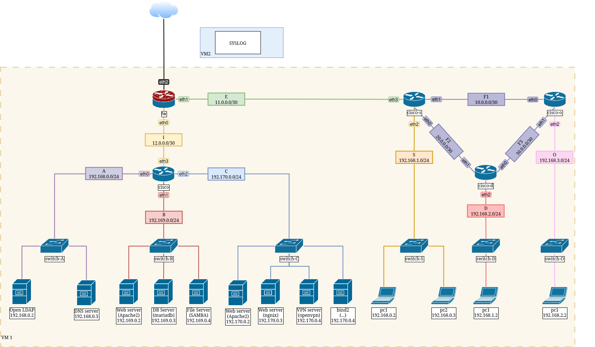
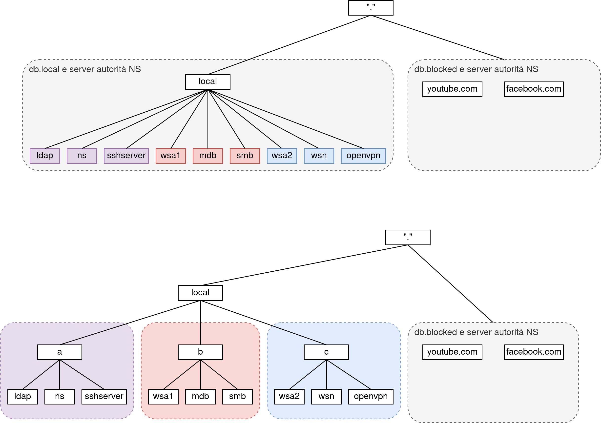

# Honeypot

## Indice
1. [Introduzione](#1-introduzione)
2. [Topologia della rete](#2-topologia-della-rete)
3. [Spazio dei nomi](#3-spazio-dei-nomi)
4. [Raggiungibilità](#4-raggiungibilità)
5. [LAN](#5-lan)
   1. [LAN A](#51-lan-a)
   2. [LAN B](#52-lan-b)
   3. [LAN C](#53-lan-c)
   4. [LAN S](#54-lan-s)
   5. [LAN D](#55-lan-d)
   6. [LAN O](#56-lan-o)
6. [Firewall](#6-firewall)
7. [Accounts](#7-accounts)

## 1. Introduzione
Questo documento descrive l'architettura di rete e le interfacce di un router, evidenziando i dispositivi collegati e le loro funzioni.

## 2. Topologia della rete

## 3. Spazio dei nomi

## 4. Raggiungibilità
|         | LAN A | LAN B | LAN C | LAN D | LAN O | LAN S | Internet |
|---------|-------|-------|-------|-------|-------|-------|----------|
| bind1   |   V   |   V   |   V   |   V   |   V   |   X   |    X     |
| oldap   |       |       |       |       |       |   X   |    X     |
| wsa1    |   V   |   V   |   V   |   V   |   V   |   X   |    X     |
| mdb     |       |       |       |       |   X   |   X   |    V     |
| wsa2    |       |       |       |       |       |   X   |    V     |
| nginx   |       |       |       |       |       |   X   |    V     |
| openvpn |       |       |       |       |       |   X   |    V     |
| bind2   |   V   |   V   |   V   |   V   |   V   |   X   |    V     |
| pcs1    |   V   |   V   |   V   |   V   |   V   |   V   |    V     |
| pcs2    |   V   |   V   |   V   |   V   |   V   |   V   |    V     |
| pcd1    |       |       |       |       |       |   X   |    V     |
| pco1    |       |       |       |       |       |   X   |    V     |

## 5. LAN
Di seguito verranno viste con maggior dettaglio le LAN (Local Area Network) ...
Intranet: A B C ...

### 5.1 LAN A
**descrizione**: La lan A è ...  
**router**: 
**hosts**:
  - ldap: 
  - `bind1`: DNS server bind9, fornisce risoluzione dei nomi per gli host nella intranet.

### 5.2 LAN B
**descrizione**: La lan B è ...  
**router**: 
**hosts**:
  - `wsa1`: *Web server apache2 dedicato per la gestione di richieste web. Contiene risorse esclusive per la intranet*
  - `mdb`: **
  - `smb`: 

### 5.3 LAN C
**descrizione**: La lan C è ...  
**router**: 
**hosts**:
  - `wsa2`: *Web server apache2 dedicato per la gestione di richieste web. Contiene risorse esclusive accessibili da internt. Wp + mariadb* 
  - `wsn`: *Web server ngnix dedicato per la gestione di richieste web. Contiene risorse esclusive accessibili da internt*
  - openvpn:
  - `bind1`: DNS server bind9, fornisce risoluzione dei nomi per gli host di internet.

### 5.4 LAN S
**descrizione**: La lan S è ...  
**router**: 
**hosts**: ...

### 5.5 LAN D
**descrizione**: La lan D è ...  
**router**: 
**hosts**: ...

### 5.6 LAN O
**descrizione**: La lan O è ...  
**router**: 
**hosts**: ...

# NAT

###### Chain PREROUTING (nat) – Port Forwarding

| num | target | prot | opt | in   | out | source    | destination | source port | destination port | DNAT to         | Note        |
| --- | ------ | ---- | --- | ---- | --- | --------- | ----------- | ----------- | ---------------- | --------------- | ----------- |
| 1   | DNAT   | tcp  |     | eth4 |     | 0.0.0.0/0 | 0.0.0.0/0   | any         | 22               | 192.168.0.4:22  | `sshserver` |
| 2   | DNAT   | tcp  |     | eth4 |     | 0.0.0.0/0 | 0.0.0.0/0   | any         | 80               | 192.169.0.2:80  | `ws1a`      |
| 3   | DNAT   | tcp  |     | eth4 |     | 0.0.0.0/0 | 0.0.0.0/0   | any         | 139              | 192.169.0.4:139 | `smb`       |
| 4   | DNAT   | tcp  |     | eth4 |     | 0.0.0.0/0 | 0.0.0.0/0   | any         | 445              | 192.169.0.4:445 | `smb `      |
| 5   | DNAT   | tcp  |     | eth4 |     | 0.0.0.0/0 | 0.0.0.0/0   | any         | 8080             | 192.170.0.3:80  | `wsn`       |

###### Chain FORWARD – Allow NAT Traffic
| num | target | prot | opt | in | out | source    | destination | source port | destination port | Note        |
| --- | ------ | ---- | --- | -- | --- | --------- | ----------- | ----------- | ---------------- | ----------- |
| 1   | ACCEPT | tcp  |     |    |     | 0.0.0.0/0 | 192.168.0.4 | any         | 22               | `sshserver` |
| 2   | ACCEPT | tcp  |     |    |     | 0.0.0.0/0 | 192.169.0.2 | any         | 80               | `ws1a`      |
| 3   | ACCEPT | tcp  |     |    |     | 0.0.0.0/0 | 192.169.0.4 | any         | 139              | `smb`       |
| 4   | ACCEPT | tcp  |     |    |     | 0.0.0.0/0 | 192.169.0.4 | any         | 445              | `smb`       |
| 5   | ACCEPT | tcp  |     |    |     | 0.0.0.0/0 | 192.170.0.3 | any         | 80               | `wsn`       |

# 6. Firewall

###### Chain INPUT (Policy ACCEPT)
| num | target | prot | opt | in | out | source     | destination | source port | destination port |
| --- | ------ | ---- | --- | -- | --- | ---------- | ----------- | ----- | --- |
|     |        |      |     |    |     |            |             |         |     |

###### Chain FORWARD (Policy DROP)
| num | target | prot | opt | in  | out | source          | destination       | source port | destination port |
|-----|--------|------|-----|-----|-----|------------------|--------------------|-------------|-------------------|
| 2   | ACCEPT | all  |     |     |     | 192.168.0.0/24   |                    |             |                   |
| 3   | ACCEPT | all  |     |     |     | 192.169.0.0/24   |                    |             |                   |
| 4   | ACCEPT | all  |     |     |     | 192.170.0.0/24   |                    |             |                   |
| 5   | ACCEPT | tcp  |     |     |     | 192.168.1.0/24   |                    |             | 22                |
| 6   | ACCEPT | all  |     |     |     |                  |                    |             |                   |

###### Chain OUTPUT (Policy ACCEPT)
| num | target | prot | opt | in | out | source     | destination | source port | destination port |
| --- | ------ | ---- | --- | -- | --- | ---------- | ----------- | ----- | ----- |
|     |        |      |     |    |     |            |             |         |     |

# 7. Accounts

### SSH

| Host    | Username | Password   | Tipo di Account       |
| ------- | -------- | ---------- | --------------------- |
| bind    | senior   | 1Password! | Amministratore Senior |
| bind    | junior   | 2Password! | Amministratore Junior |
| ldap    | senior   | 1Password! | Amministratore Senior |
| mdb     | senior   | 1Password! | Amministratore Senior |
| openvpn | senior   | 1Password! | Amministratore Senior |
| smb     | senior   | 1Password! | Amministratore Senior |
| wsa1    | senior   | 1Password! | Amministratore Senior |
| wsa1    | junior   | 2Password! | Amministratore Junior |
| wsa2    | senior   | 1Password! | Amministratore Senior |
| wsa2    | junior   | 2Password! | Amministratore Junior |
| wsn     | senior   | 1Password! | Amministratore Senior |
| wsn     | junior   | 2Password! | Amministratore Junior |

### Samba

| Host | Username | Password | Tipo di Account |
| ---- | -------- | -------- | --------------- |
| smb  | mario    | 1as-aoi  | Dirigente       |
| smb  | filippo  | lolw-9u! | Dipendete       |

### DB/phpmyadmin

| Host  | Username | Password   | Tipo di Account       |
| ----- | -------- | ---------- | --------------------- |
| mdb   | senior   | 1Password! | Amministratore Senior |
| mdb   | junior   | 2Password! | Amministratore Junior |
| mdb   | pluto   | pluto       | Da eliminare - funziona solo in v0.5-ufficiale in su |

