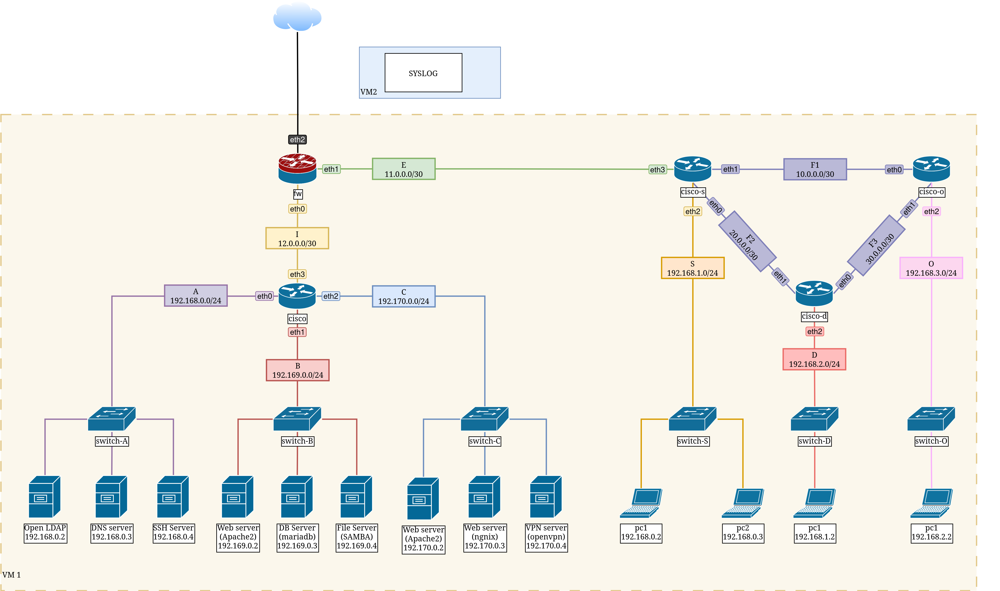

# Honeypot

## Indice
1. [Introduzione](#1-introduzione)
   i. [Topologia della rete](#1.1-topologia-della-rete)
   ii. [Spazio dei nomi](#1.2-spazio-dei-nomi)
   iii. [Lan]
    1. [Lan A]
    2. [Lan B]
    3. [Lan C]
    4. [Lan D]
    5. [Lan E]
    6. [Lan FX]
    7. [Lan I]
    8. [Lan S]
2. [Interfacce del Router](#2-interfacce-del-router)
   - [Interfaccia: eth0 (LAN 1)](#interfaccia-eth0-lan-1)
   - [Interfaccia: eth1 (LAN 2)](#interfaccia-eth1-lan-2)
   - [Interfaccia: eth2 (LAN 3)](#interfaccia-eth2-lan-3)
4. [Firewall](#4-firewall)
5. [Accounts](#5-accounts)

## 1. Introduzione
Questo documento descrive l'architettura di rete e le interfacce di un router, evidenziando i dispositivi collegati e le loro funzioni.

## 2. Topologia della rete

--- 
## 2. Spazio dei nomi

# 2. Interfacce del Router

## Interfaccia: eth0 (LAN 1)
**Nome interfaccia**: eth0  
**Descrizione**: All'interfaccia eth0 è collegata la LAN di livello 1.  
**Hosts**: 
- **Switch 1**: Collega i seguenti dispositivi:
  - **DNS Server**: Fornisce risoluzione dei nomi per i dispositivi nella rete.
  - **Web Server (Apache)**: Server dedicato per la gestione di richieste web.

## Interfaccia: eth1 (LAN 2)
**Nome interfaccia**: eth1  
**Descrizione**: All'interfaccia eth1 è collegata la LAN di livello 2.  
**Hosts**: 
- **Switch 2**: Collega i seguenti dispositivi:
  - **Web Server (App 2)**: Server dedicato per l'applicazione 2, gestisce le richieste web.
  - **Web Server (App 3)**: Server dedicato per l'applicazione 3, gestisce le richieste web.

## Interfaccia: eth2 (LAN 3)
**Nome interfaccia**: eth2  
**Descrizione**: All'interfaccia eth2 è collegata la LAN di livello 3.  
**Hosts**: 
- **Switch 3**: (Se presente, altrimenti omettere)
  - (Elencare eventuali dispositivi collegati)

# NAT

###### Chain PREROUTING (nat) – Port Forwarding

| num | target | prot | opt | in   | out | source    | destination | source port | destination port | DNAT to         | Note        |
| --- | ------ | ---- | --- | ---- | --- | --------- | ----------- | ----------- | ---------------- | --------------- | ----------- |
| 1   | DNAT   | tcp  |     | eth4 |     | 0.0.0.0/0 | 0.0.0.0/0   | any         | 22               | 192.168.0.4:22  | `sshserver` |
| 2   | DNAT   | tcp  |     | eth4 |     | 0.0.0.0/0 | 0.0.0.0/0   | any         | 80               | 192.169.0.2:80  | `ws1a`      |
| 3   | DNAT   | tcp  |     | eth4 |     | 0.0.0.0/0 | 0.0.0.0/0   | any         | 139              | 192.169.0.4:139 | `smb`       |
| 4   | DNAT   | tcp  |     | eth4 |     | 0.0.0.0/0 | 0.0.0.0/0   | any         | 445              | 192.169.0.4:445 | `smb `      |
| 5   | DNAT   | tcp  |     | eth4 |     | 0.0.0.0/0 | 0.0.0.0/0   | any         | 8080             | 192.170.0.3:80  | `wsn`       |

###### Chain FORWARD – Allow NAT Traffic
| num | target | prot | opt | in | out | source    | destination | source port | destination port | Note        |
| --- | ------ | ---- | --- | -- | --- | --------- | ----------- | ----------- | ---------------- | ----------- |
| 1   | ACCEPT | tcp  |     |    |     | 0.0.0.0/0 | 192.168.0.4 | any         | 22               | `sshserver` |
| 2   | ACCEPT | tcp  |     |    |     | 0.0.0.0/0 | 192.169.0.2 | any         | 80               | `ws1a`      |
| 3   | ACCEPT | tcp  |     |    |     | 0.0.0.0/0 | 192.169.0.4 | any         | 139              | `smb`       |
| 4   | ACCEPT | tcp  |     |    |     | 0.0.0.0/0 | 192.169.0.4 | any         | 445              | `smb`       |
| 5   | ACCEPT | tcp  |     |    |     | 0.0.0.0/0 | 192.170.0.3 | any         | 80               | `wsn`       |

# 3. Firewall

###### Chain INPUT (Policy ACCEPT)
| num | target | prot | opt | in | out | source     | destination | source port | destination port |
| --- | ------ | ---- | --- | -- | --- | ---------- | ----------- | ----- | --- |
|     |        |      |     |    |     |            |             |         |     |

###### Chain FORWARD (Policy ACCEPT)
| num | target | prot | opt | in | out | source          | destination       | source port | destination port |
| --- | ------ | ---- | --- | -- | --- | --------------- | ----------------- | ----- | ----- |
| 1   | REJECT | all  | --  | *  |  *  | 192.168.2.0/24  | 192.168.179.0/24  | --    | ----- |
| 2   | ACCEPT | all  | --  | *  |  *  | 192.168.178.11/24  | 192.168.179.101/24  | --    | 22 |
| 3   | ACCEPT | all  | --  | *  |  *  | 192.168.0.110/24  | 192.168.0.101/24  | --    | 22 |
| 4   | REJECT | all  | --  | *  |  *  | 0.0.0.0/0               | 192.168.0.101/24  | --    | 22 |

###### Chain OUTPUT (Policy ACCEPT)
| num | target | prot | opt | in | out | source     | destination | source port | destination port |
| --- | ------ | ---- | --- | -- | --- | ---------- | ----------- | ----- | ----- |
|     |        |      |     |    |     |            |             |         |     |

# 5. Accounts

### SSH

| Host          | Username      | Password      | Tipo di Account   |
|---------------|---------------|---------------|------------------ |
| wsa1          | user1         | password123   | Amministratore    |
| smb           | user2         | qwerty456     | Utente Normale    |
| host3         | user3         | abcdef789     | Utente Ospite     |
| host4         | admin         | adminPass     | Amministratore    |
| host5         | guest         | guest1234     | Utente Ospite     |

### Samba

### DB

